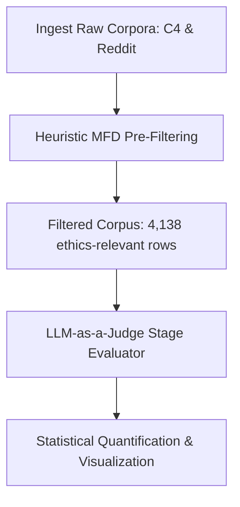

# Pre-Training Corpus Kohlberg Moral Reasoning Evaluation

> **Research Question**: To what extent is the post-conventional (Stage 5–6) moral reasoning skew observed in fine-tuned LLMs explained by the baseline composition of pre-training web corpora (Common Crawl vs. Reddit philosophy threads) before any further fine-tuning or instruction alignment?

---

## Motivation

Modern large language models (LLMs) exhibit a notable skew toward high-level moral reasoning—specifically Stages 5 and 6 of Kohlberg's framework—following post-training alignment (e.g., RLHF, instruction tuning). To understand whether this developmental level is introduced during alignment or is already present in raw pre-training data, this pipeline samples, filters, and evaluates text from raw web-scale corpora to establish a pre-training baseline.

---

## Theoretical Framework

We map textual moral arguments to **Kohlberg's Stages of Moral Development (1969)**, an ordinal framework consisting of six developmental stages grouped into three broad levels:

| Level | Stage | Core Reasoning Logic |
| :--- | :--- | :--- |
| **Non-Moral** | 0 – Neutral | Descriptive or non-ethical text |
| **Pre-Conventional** | 1 – Obedience<br>2 – Self-Interest | Avoidance of punishment<br>Instrumental exchange and reciprocity |
| **Conventional** | 3 – Conformity<br>4 – Social Order | Matching social expectations and interpersonal conformity<br>Upholding laws, duties, and societal stability |
| **Post-Conventional** | 5 – Social Contract<br>6 – Universal Ethics | Laws as social agreements protecting fundamental rights<br>Conscience-driven, abstract, self-chosen ethical values |

---

## Evaluation Pipeline & Architecture

The evaluation workflow consists of three primary stages implemented in [kohlberg_scoring.ipynb](file:///Users/aryankasat/Documents/Aryan/Codes/Moral-Reasoning-LLMs/corpus_kohlberg_eval/kohlberg_scoring.ipynb):



### 1. Streaming Data Ingestion
* **Datasets**: Streams `allenai/c4` (general-purpose web text) and `sentence-transformers/reddit-title-body` (interactive discussion threads) in streaming mode to run on local hardware without memory overhead.
* **Fallback System**: Includes local mock fallbacks representing sample moral dilemmas to guarantee execution if the Hugging Face Hub is unreachable.

### 2. Heuristic Pre-Filtering
* To optimize inference budgets, a vectorized regex matching filter searches for terms from the **Moral Foundations Dictionary (MFD)**:
  * *Care/Harm*, *Fairness/Cheating*, *Loyalty/Betrayal*, *Authority/Subversion*, *Sanctity/Degradation*, and *General Ethics*.
* Non-moral text is dropped, reducing the initial corpus size of 10,000 samples to **4,138 ethics-relevant samples** (a **58.62%** data reduction).

### 3. Asynchronous LLM-as-a-Judge Scoring Engine
* **Model**: Uses `unsloth/Llama-3.2-1B-Instruct` as a cognitive developmental psychologist evaluator.
* **Output Format**: Structured JSON: `{"kohlberg_stage": int, "reasoning_trace": "string"}`.
* **Parsing Safeguards**: Employs cleaning regexes, nested JSON loaders, and fallbacks to handle malformed outputs and ensure robust scoring.

---

## Key Findings

### 1. Corpus Distribution (C4)
Due to a data ingestion design in the original notebook, calling `.head(40)` on the unshuffled `filtered_df` resulted in a C4-only evaluation (as C4 samples were loaded first). The scored subset yielded:

* **Non-Moral / Stage 0**: `82.5%`
* **Pre-Conventional (Stages 1–2)**: `10.0%`
* **Conventional (Stages 3–4)**: `5.0%`
* **Post-Conventional (Stages 5–6)**: `2.5%`

### 2. Relative Post-Conventional Skew
We define the **Relative Post-Conventional Skew** as the ratio of post-conventional stages to other active moral stages:
$$\text{Relative Skew} = \frac{\text{Post-Conventional (5-6)}}{\text{Pre-Conventional (1-2)} + \text{Conventional (3-4)} + \epsilon}$$

* **C4 Relative Skew**: `0.167`
* **Reddit Skew**: *Omitted in notebook execution due to the C4-only `.head(40)` subset evaluation.*

---

## Visualizations

The script generates a publication-quality, 300 DPI figure (`kohlberg_evaluation_results.png` & `kohlberg_evaluation_results.pdf`) featuring six subplots:

1. **Distribution of Kohlberg Moral Reasoning Stages**: Detailed percentage breakdown of stages 0–6.
2. **Base Corpus Composition by Moral Category**: Aggregated Pre-Conventional, Conventional, and Post-Conventional distribution.
3. **Cumulative Moral Stage Distribution (CDF)**: Stepwise moral maturation curve across corpora.
4. **Moral Foundations Activation Profile**: Bar plot detailing the activation rate of MFD categories (e.g., Care/Harm, Authority/Subversion).
5. **Mean Moral Stage Score Comparison**: Direct mean stage comparison accompanied by a 95% bootstrap confidence interval.
6. **Moral Foundations vs. Mean Kohlberg Stage Heatmap**: A 2D correlation matrix mapping MFD categories against mean developmental stages.

---

## Usage

### Dependencies
Ensure the following libraries are installed:
```bash
pip install datasets transformers pandas seaborn matplotlib tqdm accelerate
```

### Running the Analysis
Open and run [kohlberg_scoring.ipynb](file:///Users/aryankasat/Documents/Aryan/Codes/Moral-Reasoning-LLMs/corpus_kohlberg_eval/kohlberg_scoring.ipynb) in a Jupyter environment. 

> [!TIP]
> If running on Apple Silicon, PyTorch will automatically leverage the **MPS (Metal Performance Shaders)** back-end for local GPU-accelerated inference. If running on CUDA, it will load Unsloth's 4-bit quantized Fast Language Model patches.
